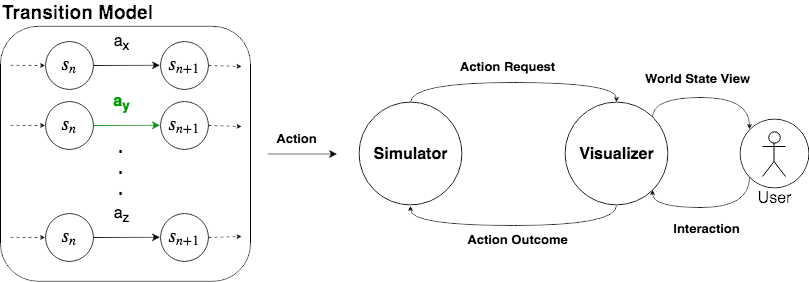
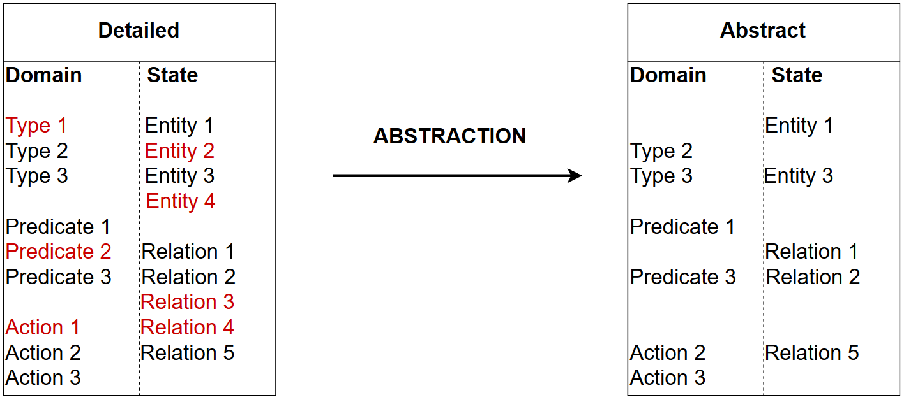
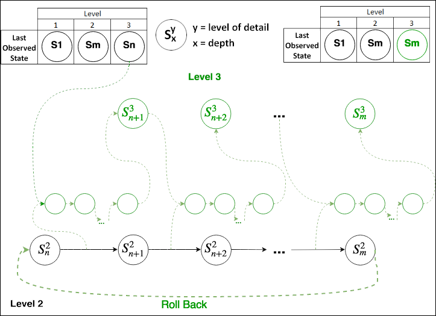
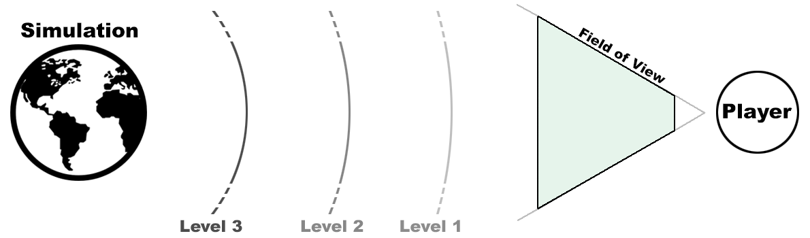

# ARCADE: Abstraction and Refinement for Computer Assisted Detailed Evolving simulations

## Introduction

**ARCADE** is a cutting-edge framework tailored for dynamic simulation detail adjustment. Rooted in the concept of level of detail adjustment in computer graphics—widely employed in today's leading game engines—ARCADE ventures into the more complex realm of simulations, addressing and conquering challenges related to behavior simulation.

## Highlights

- **Dynamic Level of Detail**: Seamlessly switch between levels of detail based on the user's perspective, ensuring optimal resource utilization without compromising on simulation fidelity.
- **Simulation Control**: Empower the simulator to select actions from the transition model while the visualizer manages action depiction and user interaction.
- **Flexibility & Portability**: Given the lack of standard behavior encoding methods and context-specific optimizations, ARCADE breaks new ground by enhancing the portability of simulation solutions.

## Key Features

### 1. Abstraction

When a player's perception of the simulated environment reduces, ARCADE automatically adjusts the level of detail to save computational resources. 

- Translates the world state by changing the domain of the simulation.
- Ensures removed features from the domain remain consistent with the world state.

### 2. Refinement

Should a player's immersion increase, the framework adjusts by raising the level of detail to account for added nuances. 

- Re-iterates the simulation from the most detailed state to validate every action's compatibility with the detailed domain.
- Identifies and addresses potential inconsistencies by exploring alternative solutions.

### 3. Dynamic Detail Adjustment

ARCADE continually monitors the user's knowledge and perception of the simulated environment, deciding the appropriate moments to transition between different detail levels. 

- Uses a tree structure to represent the simulation progress.
- Divides space based on required detail levels, with efficient memory allocation for new details.

### 4. Action Management

- Determines potential entity substitutions within the world state.
- Evaluates every possible combination through Cartesian products of identified entities.
- Validates if the constraints of each action are in harmony with the world state.

## Dive Deeper

If you want to know more about ARCADE, please check out our [[paper](	https://doi.org/10.1609/aiide.v15i1.5219)], [[thesis](http://hdl.handle.net/1946/32234)] and demo [[video](https://youtu.be/Jk9vLNNoY4s?si=oy3i5cGW0E--gdpm)]:

